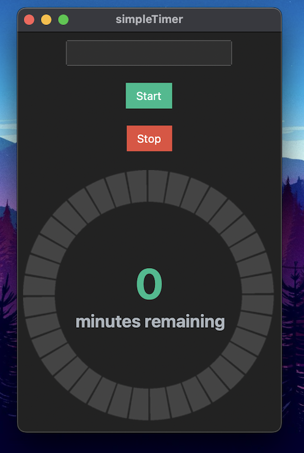
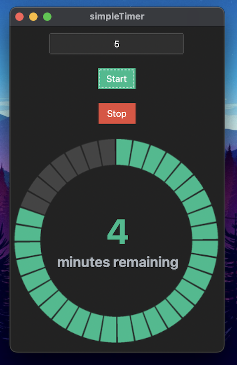

# Small Code Timer

***
## Idea
I wanted to build a small code timer for myself, to time my sessions. I took this idea to learn a bit of tkinter to create desktop python apps. Since tkinter itself does look rather old I stumbled upon [tkkbootstrap](https://github.com/israel-dryer/ttkbootstrap). This made the looks of it bit more modern.
***
## Details
This timer is so simple that it does exactly what it is meant to do. You enter the minutes in the input field and hit start. The progress of the timer is displayed minutes remaining text and represented by the meter.
Once the timer is complete, a small sound is played using [beepy for pythono](https://github.com/prabeshdhakal/beepy-v1).
Pressing the stop button will of course stop the timer and reset the app to be started again.
***
## External libraries used
- [tkkbootstrap](https://github.com/israel-dryer/ttkbootstrap)
- [beepy for pythono](https://github.com/prabeshdhakal/beepy-v1)